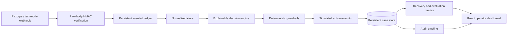

# RecoverAI architecture

## System flow

## Trust boundaries

1. **External input boundary** — Webhook bodies are untrusted until the Razorpay signature is verified against the exact raw bytes.
2. **Duplicate boundary** — At-least-once delivery is handled with a persistent ledger keyed by `x-razorpay-event-id`.
3. **Intelligence boundary** — The decision engine may diagnose and recommend, but it does not execute financial actions directly.
4. **Policy boundary** — Deterministic guardrails enforce confidence, attempt limits, cooldowns and permanent-failure stops independently of the intelligence layer.
5. **Execution boundary** — Current actions remain explicitly simulated. A real provider adapter must preserve idempotency and consent controls.

## Package responsibilities

| Package | Responsibility |
|---|---|
| `shared` | Domain contracts shared by browser and server |
| `server` | Webhook security, persistence, decisions, guardrails, execution, evaluation and APIs |
| `web` | Operator workflow, metrics, case queue, explanation and audit trail |

## Evaluation design

- The 50-case synthetic recovery batch measures simulated money recovered, escalations and stops.
- The 40-scenario held-out labelled set measures exact-action accuracy, unsafe automation and exceptions.
- Tests independently verify guardrails, Razorpay mapping and detection of an intentionally unsafe engine.

## Production evolution

Replace the JSON store with a transactional database, move execution to a durable queue, use Razorpay Test Mode credentials before live mode, store secrets in a secret manager, add authenticated operator access, and instrument retries, dead-letter events and reconciliation.
